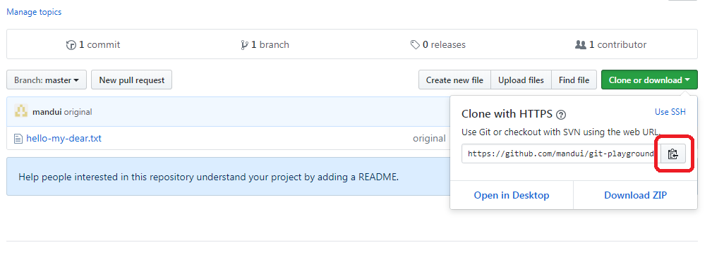

# Git

## 为什么用git?
简单来说，Github比blog更适合记录分享技术，而Github的版本管理使用了git。

不过个人仍可从学习使用Git中获益。

首先，git是当前比较主流的版本管理方式（当然并不是说svn已经过时，svn与git各有优点），而且它的学习并不复杂，掌握一点主流技术总是好的。

其次，git不光可用于公司代码管理，我个人觉得对于本地代码，使用git也是非常方便的（比如说，当前有两个需求需要开发，用git可以分出两个branch，使它们互不影响地进行）。

## 学习资源
### 获得Git
有以下几种方式，都可以安装git。

1. [Github Desktop](https://desktop.github.com/): 集成桌面版（GUI）和命令行，推荐使用。
2. [Git官方](https://git-scm.com/): 安装后可使用git bash终端，与linux下命令行相同。

### 学习
- [Git Lab](https://lab.github.com/)：英文好的同学，可自己申请一个github账号登入GitLab，里面有许多对应Course，可以跟着学习。
- [廖雪峰Git教程](https://www.liaoxuefeng.com/wiki/0013739516305929606dd18361248578c67b8067c8c017b000)：有图有视频，介绍得也很不错。
- [Git Cheatsheet](https://services.github.com/on-demand/downloads/zh_CN/github-git-cheat-sheet/)：git中最常用的命令。
- [Playground](https://learngitbranching.js.org/)：个人最喜欢的，一个git练习场，有场景可操作，帮你搞清楚这些操作究竟有什么用处。

git是一个挺好用的工具，但并不是那种今天看文档，明天就能知道该如何使用的工具，建议大家建一个github账号，可以当作服务器版本，本地远程多玩儿几回。

## Step Zero
这两天一直在看一些以前未曾接触过的技术方面，让我感慨，对于beginner来说最难的就是如何平稳正确地运行出教程的第一步，我称之为step zero。

所以这里，我写一个git的step zero，希望能对大家有帮助。

1. 确认自己安装了git：打开terminal/cmd/gitbash，输入git，出现git参数显示，说明安装成功；

2. 设置用户名和邮箱地址，这样查看记录时才能知道'你'是谁，不用担心，这些都可以再次修改；

```
git config --global user.name "Your name"
git config --global user.email "youremail@some.com"
```

3. 打开[Git-Playground Github页面](https://github.com/mandui/git-playground/tree/master)，找到这个repo的地址，并复制。



4. 本地找一个你喜欢的文件夹，打开terminal/cmd/gitbash，输入以下命令，从Github拉回一个copy，完成后你应该能看到来自过往的友好问候。

```
git clone [第2步中找到的地址]
```

5. 在文件中加入一行自己的问候，然后运行以下命令，上传修改，会需要账号和密码(邮箱/mandui@2019)，完成后在github上应该能看到你修改过的文件啦。

```
git add *
git commit -m "xxx says hi"
git push -u origin master
```

6. 至于参数是什么意思等等问题，都是后续需要自己学习的啦。
